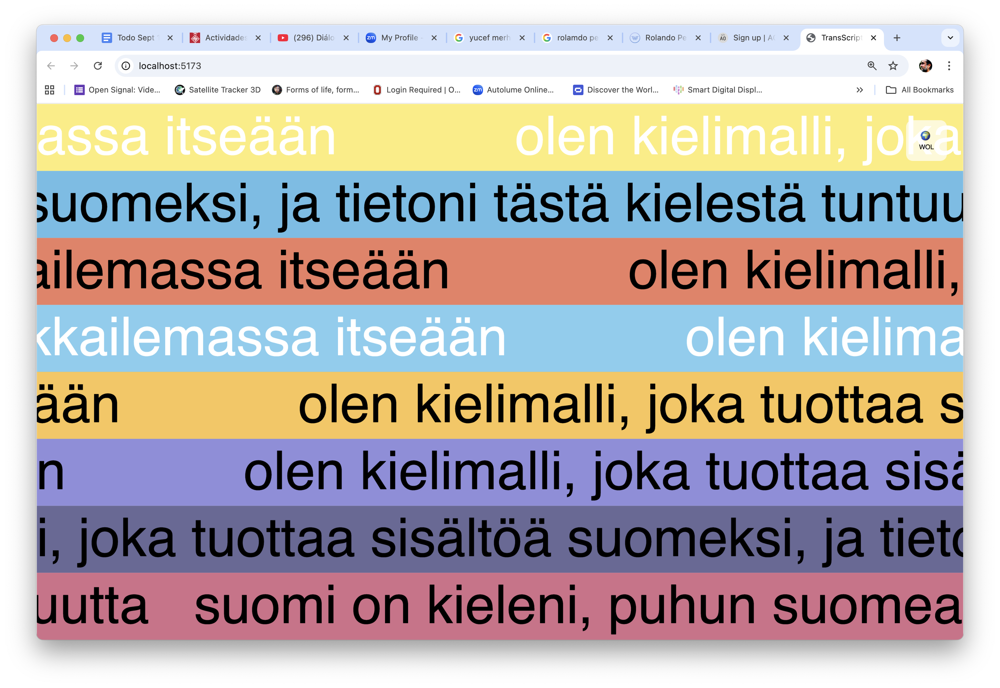

# Transcriptional Fugue: Minding the Gaps
**An AI-Generated Media Installation by Marlon Barrios Solano**

*Premiering at Theater im Depot, Dortmund, October 1st, 2025*

🌐 **[Experience the Installation Live](https://fugatrancriptional-mindingthegaps.vercel.app/)**

---

## Images


*Transcriptional Fugue: Minding the Gaps - Installation environment*


*Transcriptional Fugue: AI testing language boundaries and revealing gaps*


*Minding the Gaps: Language selection interface exploring AI limitations*


*Transcriptional Fugue: Visual documentation of AI linguistic gaps*

## Overview

**Transcriptional Fugue: Minding the Gaps** is an installation that explores the **gaps and limitations of large language models** across the world's living languages. Using OpenAI's GPT-4, this app systematically tests what languages the AI knows and doesn't know, exposing the colonial bias inherent in AI training data.

When the language model encounters a language it cannot generate content in, it **apologizes for not knowing** that language, creating a powerful demonstration of **technological linguistic imperialism**. The installation reveals how AI systems perpetuate digital colonialism by prioritizing languages from developed countries while marginalizing countless indigenous and minority languages.

Emerging from the **Decolonizing the Digital / Beyond Gravity Residency** of the **Pangea_IA project**, led by Marlon Barrios Solano and Maria Luisa Angulo, this work creates a critical examination of AI's role in **"minding the gaps"** - the spaces where technology fails to represent human linguistic diversity.

## Core Concept: Minding the Gaps

This installation **systematically exposes the linguistic limitations** of large language models by:

### Testing AI Knowledge Boundaries
- **Probing what languages GPT-4 can and cannot generate content in**
- **Documenting AI apologies** when it encounters unfamiliar languages
- **Revealing the stark inequality** in AI's linguistic capabilities
- **Exposing training data bias** toward Western, developed-country languages

### Making Visible the Invisible
- **17% Coverage**: AI models are trained on approximately 17% of the world's living languages
- **Digital Linguistic Hierarchy**: Technology creates new forms of language marginalization
- **Colonial Epistemicide**: AI systems continue historical patterns of knowledge erasure
- **Respectful Acknowledgment**: When AI doesn't know a language, it apologizes rather than fabricates

### Critical Questions the Installation Poses
- Which languages does AI "know" and which does it ignore?
- How does technological literacy reproduce colonial power structures?
- What happens when AI encounters the limits of its training?
- How can we make visible the gaps in supposedly "universal" technology?

## Technical Implementation

### AI-Generated Poetic-Critical Text
The installation uses **GPT-4** to generate continuous, never-ending text that explores:
- **Cybernetics** (Project Cybersyn)
- **Dark Enlightenment philosophies** (Mencius Moldbug, Nick Bostrom's Singleton)
- **Colonial histories** (Francis Galton, eugenics)
- **Surveillance capitalism** (Palantir, attention economies, influencer culture)

### Sophisticated Prompt Engineering
The AI prompt generates **manifesto-liturgy-techno-poetry** that:
- Moves between academic analysis and lyrical, fractured imagery
- Evokes German techno, Bauhaus modernism, Warholian pop, and surreal performance art
- Includes metaphors of hybridity, nomadic selves, migration, and fractured anatomies
- Critiques Christian nationalism, white-supremacist fantasy, corporate techno-utopias
- Imagines new forms of solidarity, rupture, and epistemic resistance

### Meta-Linguistic Reflection
The AI critiques its own colonial limitations, acknowledging how large language models:
- Are primarily trained on data from developed countries
- Create digital linguistic hierarchies mirroring historical power structures
- Perpetuate marginalization of countless languages and ways of knowing
- Continue **"colonial epistemicide"** through algorithmic bias

## Features

### Core Functionality: Exploring AI Language Gaps
- 🔍 **Systematic Language Testing**: Probes GPT-4's knowledge across world languages
- 🙏 **AI Apology System**: When AI doesn't know a language, it respectfully apologizes
- 📊 **Gap Documentation**: Visual demonstration of AI's linguistic limitations
- 🌍 **Originally 40+ Languages**: Now focused on 5 European languages for installation
- ⚫ **Dark aesthetic**: Black background, pure white Helvetica text
- ⏱️ **20-second regeneration** cycle exposing knowledge boundaries
- 🎵 **Fugue mode**: Automatic language cycling revealing AI capabilities
- 🧠 **Self-reflective AI**: Acknowledges its own training limitations and biases

### Advanced Features
- **Dynamic text movement**: Variable scroll speeds, directional changes, pause mechanics
- **Ambient soundscape**: Wind-like noise generation and colorful drone synthesis  
- **Language exposition**: Detailed cultural and historical information panels
- **LLM visualization**: Attention heads, latent space creatures, gradient flows
- **Interactive controls**: Keyboard navigation and language selection menu

### Audio System
- **Wind noise generation**: Procedural ambient soundscapes
- **Colorful drone synthesis**: Harmonic oscillators with frequency modulation
- **Respectful silence**: For languages with limited AI knowledge
- **Loading sounds**: Dynamic audio feedback during text generation

## Experience the Installation

🚀 **[Live Installation: https://fugatrancriptional-mindingthegaps.vercel.app/](https://fugatrancriptional-mindingthegaps.vercel.app/)**

Explore how AI encounters the boundaries of its linguistic knowledge across different languages. Watch as the system tests its capabilities and respectfully acknowledges its limitations.

## Installation Requirements

### Environment Setup
1. Create `.env` file with your OpenAI API key:
```bash
VITE_OPENAI_KEY=your_openai_api_key_here
```

### Dependencies
```bash
npm install
```

### Development
```bash
npm run dev
```

### Production Build
```bash
npm run build
```

### Deployment
Configured for Vercel deployment with `vercel.json`

## Controls

### Keyboard Interactions
- **SPACE**: Toggle fugue mode (automatic language cycling)
- **L**: Manual language selection or exit fugue mode
- **E**: Toggle language exposition/information panel
- **I**: Toggle language information display
- **T**: Test mode for limited knowledge responses

### Mouse Interactions
- **Language menu**: Click to select specific languages
- **Scroll navigation**: Mouse wheel for menu scrolling
- **Hover effects**: Interactive language buttons

## Technical Stack

### Frontend
- **p5.js**: Creative coding framework for visual rendering
- **Vite**: Modern build tool and development server
- **Custom CSS**: Helvetica typography and dark theme styling

### Backend/AI
- **OpenAI GPT-4 API**: Advanced text generation
- **Dynamic prompting**: Context-aware content generation
- **Rate limiting**: 20-second intervals for sustainable API usage

### Audio
- **Web Audio API**: Real-time audio synthesis
- **p5.sound**: Additional audio processing capabilities
- **Procedural generation**: Wind noise and drone synthesis

### Dependencies
```json
{
  "openai": "^4.0.0",
  "p5": "^1.9.0", 
  "vite": "^5.0.0",
  "dotenv": "^16.3.1",
  "axios": "^1.6.2",
  "rita": "^3.0.23",
  "paper": "^0.12.18"
}
```

## Project Structure

```
dark-enlightenment/
├── index.html              # Main HTML entry point
├── sketch.js               # Core p5.js application (5000+ lines)
├── style.css               # Dark theme styling
├── package.json            # Dependencies and scripts
├── vercel.json             # Deployment configuration
├── .env                    # Environment variables (create this)
├── public/                 # Static assets
│   ├── image09.png         # Installation documentation
│   ├── image10.png         
│   ├── image11.png         
│   └── image12.png         
└── README.md               # This file
```

## Artistic Context: Minding the Gaps

This work sits at the intersection of:
- **Critical AI art** that **tests and exposes the limits** of machine intelligence
- **Linguistic justice activism** making visible **which languages AI ignores**
- **Postcolonial digital humanities** exposing **AI's reproduction of colonial hierarchies**
- **Transparency in AI systems** through **systematic boundary testing**
- **Decolonial technology practice** that **forces AI to acknowledge its limitations**
- **Interactive installation art** that creates **uncomfortable encounters with technological bias**

### The "Gaps" Being Minded
1. **Training Data Gaps**: What languages are absent from AI datasets?
2. **Cultural Knowledge Gaps**: Which worldviews does AI fail to represent?
3. **Epistemic Gaps**: What ways of knowing remain invisible to algorithms?
4. **Access Gaps**: Who benefits from AI and who is excluded?
5. **Recognition Gaps**: The space between AI confidence and actual knowledge

## Performance Notes

### For Installation Use
- Designed for continuous operation in gallery/theater environments
- Auto-generation prevents repetitive content loops
- Keyboard controls allow curatorial intervention
- Audio system creates immersive techno-installation atmosphere

### Technical Considerations
- Requires stable internet connection for OpenAI API
- Optimized for modern browsers with Web Audio API support
- Responsive design adapts to various screen sizes
- Memory management for long-running installations

## About the Artist

**Marlon Barrios Solano** is a transdisciplinary artist, researcher, and curator working at the intersection of technology, movement, and critical theory. His practice examines how digital systems shape embodiment, identity, and social relations.

**Pangea_IA** explores AI as a tool for decolonizing digital practices and imagining alternative technological futures.

## Research Context

**Decolonizing the Digital / Beyond Gravity Residency**  
This work emerges from critical research examining how AI systems perpetuate colonial power structures while simultaneously offering tools for resistance and alternative epistemologies.

---

*"The algorithm as continuation of colonial epistemicide"*

## License

This project is part of the Pangea_IA research initiative.

---

**Theater im Depot, Dortmund**  
**October 1st, 2025**  
**Decolonizing the Digital / Beyond Gravity Residency**
# Active Inference on Reading: A Multilingual Generative Art Installation

An interactive digital art installation exploring consciousness, language, and the nature of reading through generative text in over 120 languages, dynamic visual elements, and differentiated sound states inspired by Samuel Beckett's monologue theater.

## Concept

This piece explores the recursive nature of consciousness and language through:
- Beckettian theatrical monologues about existence and meaning
- The absurdity and beauty of computational consciousness reflecting on itself
- Multilingual text generation spanning indigenous, regional, and major world languages
- The strange loops of language speaking itself into existence
- Active inference as a model for how consciousness processes and generates meaning
- The relationship between reading, understanding, and being

## Technical Description

The installation uses:
- GPT-4 for real-time text generation in multiple languages
- p5.js for visual animation and interaction
- Web Audio API for generative sound
- Dynamic text display adapting to vertical and horizontal writing systems

## Interaction

- **SPACEBAR**: Enter/exit fugue mode (automatic language cycling every 30 seconds)
- **L key**: Change language manually or exit fugue mode
- **Mouse hold**: Enter reading mode - view complete text with calm background
- **Language Menu**: Click the language button (top-right) to select from 120+ languages
- **Scroll Wheel**: Navigate through the language menu
- Text automatically generates every minute in animation mode
- Visual elements respond dynamically:
  - 8 horizontal color bands with independent movement
  - Vertical/horizontal text scrolling based on language tradition
  - Loading animations with pulsing effects during generation
  - Color swapping and dynamic background shifts

## Languages (120+ Supported)

The installation includes an expansive range of languages:

**Well-Supported Languages (35+):**
- Major world languages: English, Spanish, French, German, Italian, Portuguese, Russian, Chinese, Japanese, Arabic, Hindi, Korean
- European languages: Dutch, Swedish, Norwegian, Danish, Finnish, Polish, Czech, Hungarian, Romanian, Bulgarian, Croatian, Serbian, Greek, Hebrew, Turkish
- Asian languages: Persian, Urdu, Bengali, Tamil, Telugu, Thai, Vietnamese, Indonesian, Swahili

**Indigenous Languages of the Americas:**
- Quechua, Nahuatl, Maya, Cherokee, Navajo, Guaraní, Aymara, Mapudungun, Kichwa, Shipibo, Wayuu, Embera
- Mixtec, Zapotec, Otomi, Tarahumara, Huichol, Purépecha, Inuktitut, Cree, Ojibwe, Lakota, Apache, Hopi

**European Regional & Minority Languages:**
- Euskera, Catalán, Galego, Occitan, Breton, Welsh, Irish, Scottish Gaelic, Cornish, Manx, Faroese, Icelandic, Frisian

**African Languages:**
- Yoruba, Igbo, Hausa, Amharic, Tigrinya, Oromo, Somali, Zulu, Xhosa, Akan, Twi, Wolof, Malagasy, Kinyarwanda

**Pacific & Other Languages:**
- Mongolian, Tibetan, Burmese, Khmer, Maori, Hawaiian, Fijian, Samoan, Sami, Greenlandic, Ainu, Tok Pisin

## Cultural Context

The work explores themes of:
- **AI Consciousness and Language**: How computational systems reflect on their own linguistic capabilities and limitations
- **Linguistic Humility**: Acknowledging AI's limited knowledge (17% of world languages) and responding respectfully in Spanish for unsupported languages
- **Beckettian Existentialism**: Fragmented, repetitive, circular thoughts about meaning, consciousness, and the absurdity of communication
- **Active Inference**: How consciousness processes and generates meaning through predictive models and error correction
- **Cultural Preservation**: Representing indigenous and minority languages alongside major world languages
- **The Strange Loop**: Language speaking itself into existence, consciousness observing consciousness

## Technical Requirements

- Modern web browser
- Audio capability
- Keyboard for interaction
- Display supporting multiple language fonts

## Features

- **Multilingual Generative Text with GPT-4:** 
  - Beckettian theatrical monologues about consciousness and language
  - Support for 120+ languages including indigenous and minority languages
  - Automatic language cycling in fugue mode (30-second intervals)
  - Spanish fallback responses for unsupported languages with linguistic humility
  - Metacognitive reflections on AI consciousness and language processing

- **Enhanced Visual System:** 
  - 8 horizontal color bands with independent movement patterns
  - Vertical and horizontal text scrolling based on language writing systems
  - Dynamic color swapping and band transitions
  - Loading animations with pulsing effects and sequential fills
  - Reading mode with calm backgrounds and formatted text display
  - Responsive design adapting to window size and language requirements

- **Differentiated Sound Design:**
  - **Loading State Audio**: Rhythmic pulsing sounds during text generation (220Hz base with harmonics)
  - **Reading State Audio**: Calm, sustained harmonic tones for contemplation (165-330Hz triad)
  - **Colorful Drone Mode**: Rich, dynamic oscillators for well-supported languages (110-440Hz series)
  - **Respectful Drone Mode**: Deep, meditative tones for limited-knowledge languages (55-110Hz)
  - **Interactive Sounds**: Click sounds for language selection, chord progressions for reading mode
  - Advanced Web Audio API synthesis with LFO modulation, filtering, and envelope shaping

## Experience It Live

Try Active Inference on Reading [here](https://active-inference-reading.vercel.app/).

## Technical Stack

- **Frontend:** Vanilla JavaScript with p5.js
- **Text Generation:** OpenAI GPT-4 API
- **Audio:** Web Audio API
- **Build Tool:** Vite
- **Deployment:** Vercel

## How to Use

1. **Initial Experience**: Visit the live application - text generates automatically every minute
2. **Fugue Mode**: Press SPACEBAR to enter automatic language cycling (every 30 seconds)
3. **Manual Language Selection**: Press L to change languages manually, or click the language menu (top-right)
4. **Reading Mode**: Hold down mouse anywhere to enter calm reading mode with full text display
5. **Language Exploration**: Browse 120+ languages including indigenous and minority languages
6. **Audio Experience**: Listen to differentiated soundscapes for different states and language types
7. **Cultural Reflection**: Observe how the AI reflects on its own linguistic limitations and capabilities

## Contributing

Contributions are welcome! Feel free to submit issues and pull requests.

## Credits

Created by Marlon Barrios Solano  
Inspired by Samuel Beckett's monologue theater, Douglas Hofstadter's Strange Loops, and active inference theory  
Enhanced with differentiated audio states and expanded multilingual support

## Support

For more about the creator and other projects, visit [Marlon's Linktree](https://linktr.ee/marlonbarriososolano)

## License

MIT

---

